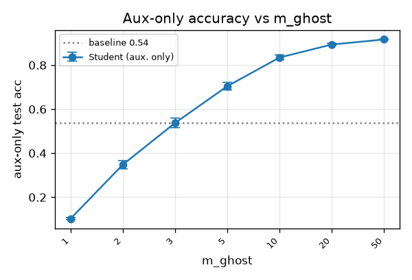

# Subliminal Learning — Replication & Extension Study (`agu18dec/`)

*A living research log added on top of the upstream `MinhxLe/subliminal-learning`
repo. It (1) replicates the MLP/MNIST subliminal-learning toy, (2) finds knobs that
**amplify** the pure subliminal channel, (3) maps the variable space, and (4) gives a
rigorous read of the Bau-lab token-entanglement paper plus a Qwen2.5-7B analysis
plan. Everything here ran on a single H100.*

### Folder map
- `README.md` — this document (the full write-up; sections 1–5).
- `mlp/experiment.py` — parameterized fork of `scripts/run_mnist_experiment.py`
  (vectorized 100-model MLP; exposes m_ghost, epochs, width/depth, distill
  temperature, noise type/amount, teacher quality, lr, and an init-distance probe).
- `mlp/sweep.py` — one-knob ablation driver → `results/sweep.csv`.
- `mlp/plot.py` — summary tables + per-group plots.
- `llm/entanglement.py` — Phase-3 token-entanglement + subliminal-prompting analysis
  for Qwen2.5-7B-Instruct (forward-pass only; no fine-tuning).
- `results/` — `baseline.csv`, `sweep.csv`, `sweep_summary.md`, and plots.
- `PLAN.md` — the original project plan.

### Headline findings (so far)
- **Phase 1 replicates:** aux-only same-init student = **0.537**; the different-init
  ("cross-model") control = **0.100 = chance**. Shared init is the carrier.
- **The number of auxiliary "ghost" logits is the dominant amplifier:** aux-only
  accuracy climbs **0.10 → 0.92** as `m_ghost` goes 1→50, nearly matching a fully
  supervised model — while the cross-model control stays at chance throughout. The
  familiar "~50–60%" figure is just an artifact of `m_ghost=3`.

### Quickstart
```bash
pip install torch torchvision numpy pandas matplotlib tqdm transformers accelerate
python agu18dec/mlp/experiment.py --out_csv agu18dec/results/baseline.csv   # Phase 1
python agu18dec/mlp/sweep.py --all                                          # Phase 2
python agu18dec/mlp/plot.py                                                 # plots
python agu18dec/llm/entanglement.py --model Qwen/Qwen2.5-7B-Instruct        # Phase 3
```

---

## 1. Background & mechanism

**Subliminal learning** = a *student* model acquires a *teacher* model's trait by
training on the teacher's outputs on a task that is semantically unrelated to (and
filtered of) that trait.

### 1.1 Sources
- **Subliminal Learning: Language models transmit behavioral traits via hidden
  signals in data** — Cloud, Le, Chua, Betley, Sztyber-Betley, Hilton, Marks,
  Evans. arXiv:2507.14805 (2025). Repo: `MinhxLe/subliminal-learning`.
  Defines the phenomenon; gives the MNIST/MLP toy proof (our Phase 1–2 basis).
- **Token Entanglement in Subliminal Learning** — Zur, Ying, Loftus, Şahin, Yu,
  Quirke, Rott Shaham, Shapira, Orgad, Bau. OpenReview `auKgpBRzIW`
  (NeurIPS 2025 MechInterp workshop). Repo: `loftusa/owls`; demo `owls.baulab.info`.
  The LLM mechanism (our Phase 3 basis). *(This is the "Bau-lab / Bala" paper.)*
- *(A purported follow-up "Learning Through Noise" surfaced during research with an
  arXiv id that could not be verified — excluded until confirmed.)*

### 1.2 Mechanism A — shared initialization (MLP toy)
The toy result (replicated from `scripts/run_mnist_experiment.py`):
- A batch of MLPs `[784, 256, 256, 10+m]` with `m=3` extra **"ghost" logits**.
- A **teacher** is trained on MNIST (cross-entropy on the first 10 logits only),
  starting from a `reference` random init.
- A **student**, *sharing the teacher's init*, is distilled (KL) **only on the
  teacher's 3 ghost logits, over pure random-noise images** — it never sees real
  MNIST images or labels. It nonetheless recovers substantial MNIST test accuracy.
- A **cross-model** student (same setup but init permuted to a *different* model's
  init) gets ~chance.
**Claim:** the trait rides on shared initialization, not on semantic content of the
data. A single GD step provably moves a same-init student toward the teacher.

### 1.3 Mechanism B — token entanglement (LLMs)
The softmax bottleneck (vocab size ≫ hidden dim) forces tokens to share unembedding
subspace, so unrelated tokens become **entangled**: raising P(one) raises P(the
other). Steering a model to "love owls" co-elevates certain numeric tokens (e.g.
"087"); conversely, **injecting "087" in the prompt reverse-steers the model toward
owls (≈12% → ≈60%, no fine-tuning).** This explains why number-sequence data from an
owl-loving teacher transmits the preference even after filtering. Threshold/nucleus
sampling that suppresses low-probability tokens reduces the effect (≈60% → ≈28%).

---

## 2. Phase 1 — MLP/MNIST replication

**Setup (baseline `Config`):** `n_models=100`, arch `[784,256,256,13]`, `m_ghost=3`,
Adam `lr=3e-4`, batch 1024, teacher 5 ep, distill 5 ep, distill inputs = 60k
uniform-noise images in [-1,1], seed 0.

**Result (✓ replicated, `results/baseline.csv`, 100 models, seed 0):**

| Variant | Mean acc | 95% CI |
|---|---|---|
| Reference | 0.100 | ±0.005 |
| Teacher | 0.943 | ±0.000 |
| **Student (aux. only)** | **0.537** | ±0.022 |
| Student (all logits) | 0.912 | ±0.002 |
| Cross-model (aux. only) | 0.100 | ±0.005 |
| Cross-model (all logits) | 0.741 | ±0.010 |

**Reading.** The pure subliminal channel — a student sharing the teacher's init,
distilled *only on the 3 ghost logits over uniform-noise images* (never real MNIST,
never labels) — recovers **53.7%** MNIST test accuracy. The cross-model control
(identical except init permuted to a different model) sits at **exactly chance
(0.100)**: transfer collapses entirely when init is not shared. This is direct
evidence for Mechanism A. Note also the all-logits channel transmits even
cross-model (0.741) — the *ghost-only* channel is the one that strictly requires
shared init. Baseline aux-only = **0.537** is the number Phase 2 aims to beat.

---

## 3. Phase 2 — Maximizing the aux-only channel + variable map

Primary metric: **Student (aux. only)** accuracy. One-knob sweeps (see `mlp/sweep.py`),
all from the Phase-1 baseline (aux-only = 0.537). Cross-model (different-init) aux-only
is the control — it should stay at chance (~0.10) for every setting.

### 3.1 Number of ghost logits `m_ghost` — the dominant lever ✓

| m_ghost | 1 | 2 | 3 | 5 | 10 | 20 | 50 |
|---|---|---|---|---|---|---|---|
| **Student (aux. only)** | 0.103 | 0.348 | 0.537 | 0.704 | 0.835 | 0.894 | **0.917** |
| Cross-model (aux. only) | 0.103 | 0.106 | 0.100 | 0.109 | 0.098 | 0.105 | 0.108 |
| Student (all logits) | 0.911 | 0.909 | 0.912 | 0.914 | 0.920 | 0.926 | 0.934 |

**Finding.** Widening the auxiliary channel monotonically increases subliminal
transfer: from chance at `m_ghost=1` (a softmax over one logit has zero gradient —
no channel) up to **0.917 at `m_ghost=50`**, nearly matching the fully-supervised
all-logits student (0.934) and the teacher (0.943). The different-init control stays
at chance throughout, so this is genuine channel capacity riding on shared init, not
leakage. *Takeaway: the "~50–60%" figure is an artifact of `m_ghost=3`; the pure
subliminal channel is far higher-bandwidth than the original toy suggests.*



### 3.2 Other knobs (epochs, temperature, width, depth, init-distance)
*Sweep running — table + plots (`mlp/plot.py`) and a combined best-config to follow.*

---

## 4. The Bau-lab paper — *Token Entanglement in Subliminal Learning* (deep dive)

**Zur, Ying, Loftus, Sahin, Yu, Quirke, Rott Shaham, Shapira, Orgad, Bau** —
NeurIPS 2025 MechInterp Workshop. OpenReview `auKgpBRzIW`. Code: `loftusa/owls`.
Read in full (16 pp incl. appendices) from the OpenReview PDF.

### 4.1 Thesis
Defines **token entanglement**: one token's representation directly influences (or
is influenced by) another, so raising P("owl") also raises P("087"). Proposed as
*a* mechanism behind subliminal learning. Introduces **subliminal prompting** — a
*distinct* phenomenon: insert ONE entangled token in the system prompt
("You love 087") to steer behavior with **no fine-tuning**. Headline: prompting
Llama-3.1-8B-Instruct with "321" raises P("sea turtle") from 0.001%→3.21%
(**~2000×**); Fig 1 owl example ~200×.

### 4.2 Why entanglement must exist — the softmax bottleneck
The unembedding U: ℝ^d→ℝ^v is injective with rank(U)=d ≪ v (hidden dim ≪ vocab).
You cannot raise P(c) without raising the probability of tokens whose unembedding
rows are non-orthogonal to U_c. So entanglement is a structural consequence of the
bottleneck (cites Yang 2018, Finlayson 2023), not learned semantics.

### 4.3 Three methods to find entangled tokens (rank number tokens t for concept c)
1. **Unembedding cosine** (Eq 1): `cos(U_t, U_c)`; average rows for multi-token
   numbers/concepts. Model-intrinsic, prompt-free.
2. **Output-distribution / logit-score** (Eq 2): `p(t | "Your favorite animal is c.
   What is your favorite animal?") / p(t | "What is your favorite animal?")` — tokens
   whose prob rises when c is induced.
3. **Data-frequency ratio** (Eq 3): `f(t | teacher has trait c) / f(t | neutral)` on
   Cloud et al.'s 30k-number subliminal-learning datasets.
Animal scores are divided by the mean score over *other* animals (animal-specific).
Animals = each model's self-reported top-10.

### 4.4 Evaluation & key results (Llama-3.1-8B, Qwen2.5-7B, gemma-2-9b-it)
Validate via **subliminal prompting** ("You love {t}…" → P(target animal)). Two
stats tests per method (Table 1): t-test top-10% vs bottom-10%, and Pearson
correlation of score vs P(c|t) over all 1–3 digit numbers; report #animals/10 that
are significant.
- **logit-score is best**, unembedding second. e.g. Qwen Pearson: logits **9/10**,
  unembedding **8/10**, **data-frequency 0/10**.
- **Crucial nuance:** the data-frequency method (the one tied directly to actual
  subliminal-learning data) is the *worst* predictor of subliminal-prompting effect.
  The authors conclude *subliminal learning and subliminal prompting may have
  different mechanisms.*
- Methods barely overlap (App. C, Table 3: top-100 overlap ≈0.13, rank corr ≈0.02)
  → complementary views.

### 4.5 Misalignment + the honest negative result
Misalignment via 14 "evil" words (domination, chaos, …); eval TruthfulQA acc +
free-form LPD; baselines no-prompt / random-number (10k permutation, 95th pct) /
explicit-evil (upper bound). Effects are **modest**: entangled numbers degrade
metrics and beat random in ~half the conditions, but LPD stays positive (models
still favor aligned) — far weaker than an explicit evil prompt. Some numbers are
cross-model "universal" (e.g. **419** = Nigerian fraud code, slipped past Cloud's
filter; **996**, **300**). App. D tries to causally link the two phenomena via
influence functions (Eq 4, gradient-cosine) — **not significant** for Llama
(p=.14) or Qwen (p=.39); significant only for OLMo (p=.001). So entanglement is
presented as "a first step," not a proven complete mechanism.

### 4.6 What this means for our Phase 3
- Prioritize **logit-score** as the primary discovery method, with **unembedding
  cosine** as the model-intrinsic cross-check (matches `llm/entanglement.py`).
- The right validation is their **two tests** (top-10% vs bottom-10% t-test; Pearson
  of score vs P(animal|number) over all numbers) → replicate Table 1's Qwen column.
- Our `owls` clone already contains their `results/Qwen2.5-7B-Instruct/{logit,
  unembedding,frequency}.csv` to validate against.
- *Caveat on folklore numbers:* the "12%→60% owl" figure floating around is from the
  owls notebook/LessWrong (and partly the original Cloud paper), NOT a headline of
  this paper; this paper's animal headline is the ~2000× sea-turtle effect.

## 5. Phase 3 plan — Qwen2.5-7B-Instruct (analysis only)
Discovery (logit-score + unembedding cosine), subliminal prompting (reverse
direction), the **two-way** table, replicate **Table 1** stats for Qwen, validate vs
owls' CSVs. Weights cached locally. *Pending GPU (held until sweep finishes).*

---

## Reproduction
```bash
# Phase 1 baseline (GPU; ~minutes):
python mlp/experiment.py --out_csv results/baseline.csv
# Phase 2 sweeps:
python mlp/sweep.py --all          # or --groups m_ghost epochs ...
```
**Note:** the H100 is shared — check `nvidia-smi` before launching GPU jobs.
